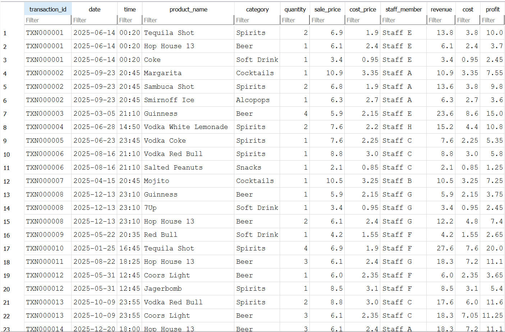
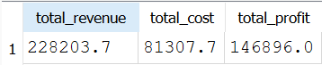
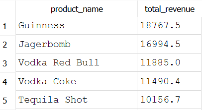
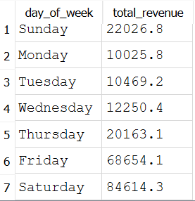

# Gleesons Pub Sales SQL Analysis

## 1. Project Overview

This project was built to analyse sales data from Gleesons, the pub I work in. It uses SQL to answer a range of business questions about revenue, profit, product and category performance, staff activity, and trading patterns. The dataset is loaded into a local SQLite database with Python, and all analysis is carried out using SQL queries.

For this public repository, that data has been replaced with a simulated dataset so the SQL queries and analysis approach can be shared without exposing business information.

This project builds upon my previous Power BI dashboard project, which used the same pub sales dataset to build visual reports. Here, the
same type of business questions are approached directly through SQL,
demonstrating the ability to query and interpret data without a
visualisation layer in between.

## 2. Project Aim

The aim of this project is to demonstrate practical SQL skills by answering business questions, including:

- Overall revenue, cost, and profit performance
- Product performance (best and worst sellers)
- Category performance (e.g. Beer, Wine, Spirits, Soft Drinks)
- Staff sales activity
- Trading day and trading hour patterns
- Profit margins across products and categories

## 3. Dataset

The dataset used in this project is `data/pub_sales_data.csv`. It contains
individual sales line items, with the following columns:

| Column         | Description                                   |
|----------------|------------------------------------------------|
| Transaction ID | Unique ID shared by all items in one order     |
| Date           | Date of sale (YYYY-MM-DD)                      |
| Time           | Time of sale (24-hour clock)                   |
| Product Name   | Name of the item sold                          |
| Category       | Product category (e.g. Beer, Wine, Spirits)    |
| Quantity       | Number of units sold in the line item          |
| Sale Price     | Price per unit charged to the customer         |
| Cost Price     | Cost per unit to the pub                       |
| Staff Member   | Staff member who processed the sale            |
| Revenue        | Quantity × Sale Price                          |
| Cost           | Quantity × Cost Price                          |
| Profit         | Revenue − Cost                                 |

The dataset covers a full year of simulated trading activity.

## 4. Data Privacy Note

The dataset provided here is simulated, it was created for portfolio purposes. It follows the same structure as the original POS data (columns, categories, and overall shape), but all transaction IDs, product names, staff members, dates, times, and figures are artificially generated and are not linked to any real customer, employee, or company records.

## 5. Business Questions Answered

The SQL files in this project answer questions such as:

- What is the total revenue, cost, and profit over the year, and how does
  it trend month by month?
- Which products sell the most, and which generate the most revenue and
  profit?
- How do different product categories compare in terms of sales and
  profitability?
- How is sales activity distributed across staff members?
- Which days of the week and hours of the day are busiest?
- Which products and categories have the highest and lowest profit
  margins?

The full list of questions, grouped by theme, can be found as comments
above each query in the `sql/` folder.


## 6. Repository Structure

```
gleesons-pub-sales-sql-analysis/
├── data/
│   └── pub_sales_data.csv         Simulated/anonymised source dataset
├── scripts/
│   └── load_data.py               Loads the CSV into a SQLite database
├── sql/
│   ├── 01_create_table.sql        Table schema reference
│   ├── 02_basic_sales_analysis.sql
│   ├── 03_product_analysis.sql
│   ├── 04_category_analysis.sql
│   ├── 05_time_analysis.sql
│   ├── 06_staff_analysis.sql
│   └── 07_profitability_analysis.sql
├── screenshots/                   Screenshots of query results
└── README.md
```

## 7. Key Findings

This SQL project builds on my previous Gleesons Pub Sales Analytics Dashboard, which was created in Power BI. The Power BI dashboard used visuals, KPI cards, and slicers to explore sales performance and identify trends in the data.

This project takes the same type of analysis and applies it directly through SQL queries. Instead of using dashboard visuals, the analysis uses SQL to calculate revenue, profit, product performance, monthly trends, and profit per pint.

The SQL analysis produced the same key finding as the Power BI dashboard: after Beamish was introduced, Guinness sales declined, while Beamish generated less revenue per pint. This suggested that Beamish was replacing Guinness sales rather than adding meaningful new revenue.

The purpose of this SQL project is to show that the same business insight can be supported using SQL, not just dashboard visuals.


## 9. Screenshots

### Database Table Preview


### Basic Sales Summary


### Top Products by Revenue


### Revenue by Day of Week


## 10. How to Run the Project

1. Clone or download this repository.
2. Build the SQLite database from the CSV:
   ```
   python scripts/load_data.py
   ```
   This creates `gleesons_pub_sales.db` in the project root, with the
   cleaned data loaded into a table called `pub_sales`.
3. Run the SQL files against the database using a SQLite client of your
   choice (e.g. the `sqlite3` command-line tool or DB Browser for SQLite),
   starting with `sql/01_create_table.sql` for the schema, then the
   numbered analysis files in `sql/`.

## 11. What I Learned

_[Add a short reflection here once the analysis is complete — e.g. SQL
techniques practised, insights into how the dataset behaves, and how this
project compares to approaching the same kind of data through Power BI.]_
